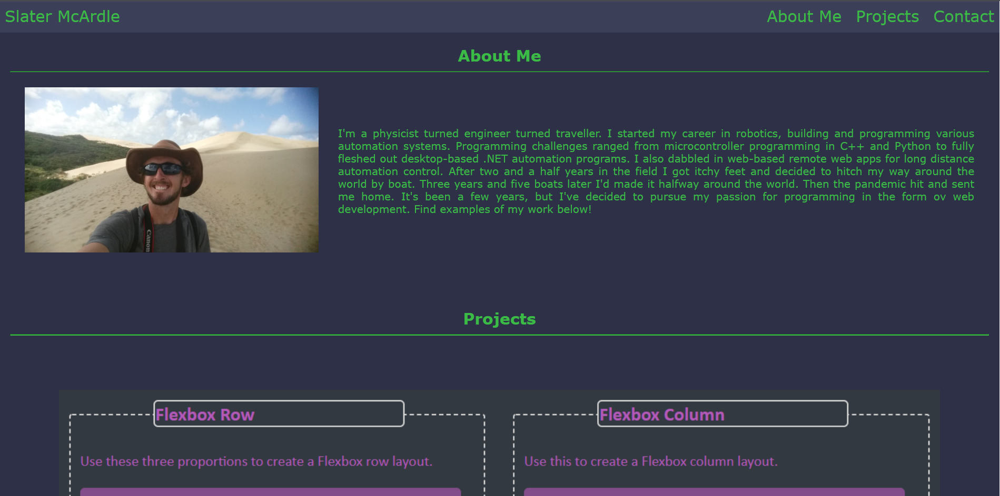
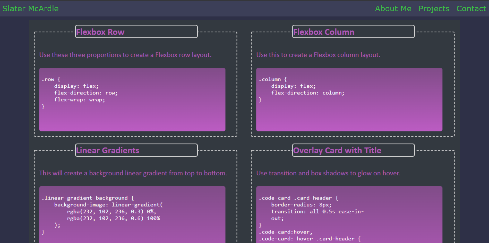
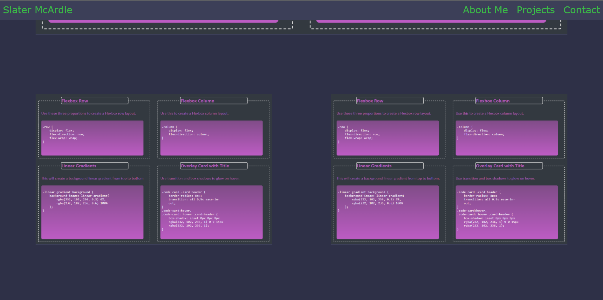
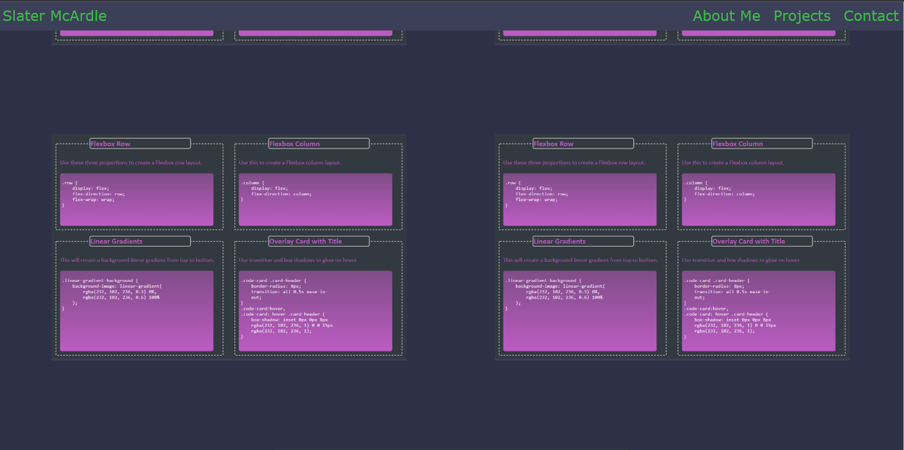

# homework_02
UCSD Coding Boot Camp Homework 02

This week's criteria were as follows:

1. developer's name, recent photo and links to sections about them, their work and how to contact them. 
    - I keep my name on the top left of the fixed navbar. The navbar also contains links to my about me (top section), project, and contact sections.
2. Links to different sections scroll to that section when clicked.
    - Navbar links all work. I also added padding at the top of the sections to leave room for the navbar at the top of the page.
3. When the project section link is clicked, the user is taken to a section with titled images of the developer's work.
    - This was acheived. However the titles (as image headers) and brief descriptions (as image footers) are only visible on hover.
4. Developer's first project is larger than the rest.
    - This was acheived. It had a larger flex basis than the rest of the cards. 
5. Images are clickable links to the deployed applications.
    -The images are clickable links. The projects and links however, are placeholders.
6. WHen the application is resized, the page has a responsive layout to adapt to viewport sizes.
    - This was acheived with a combination of flexbox and media queries

Screenshots:

